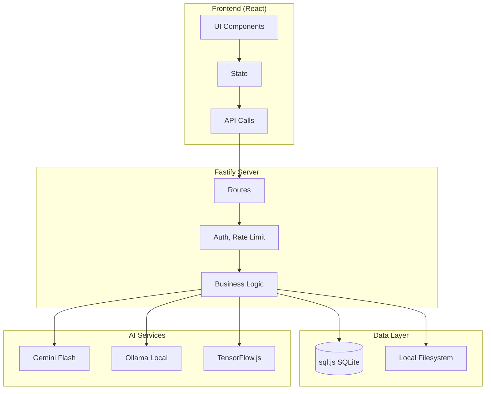
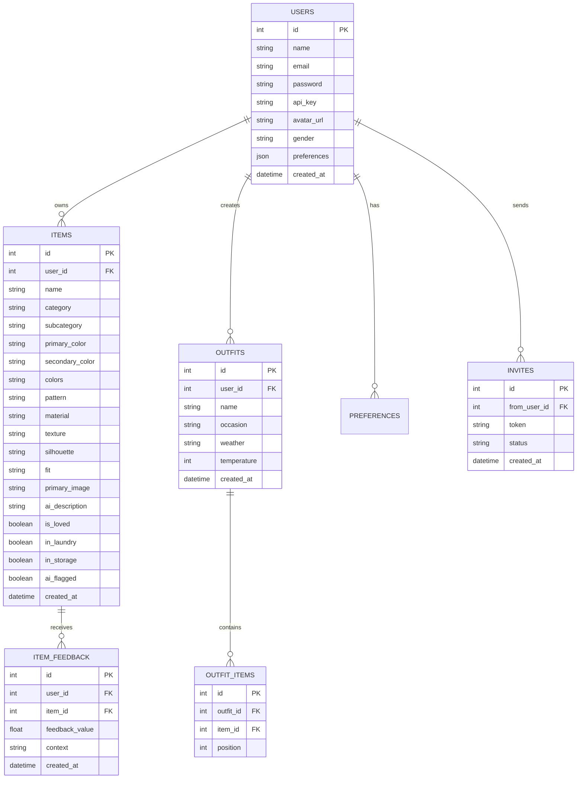
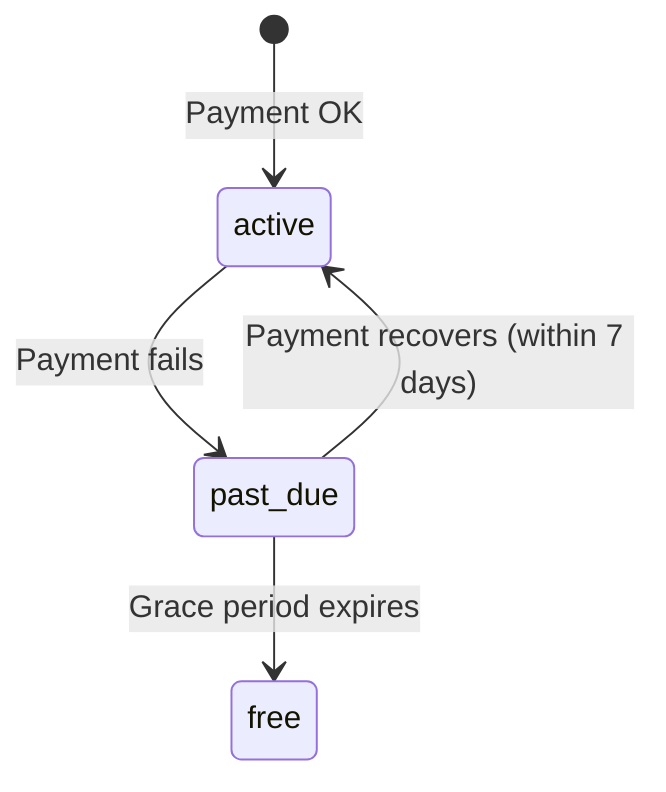
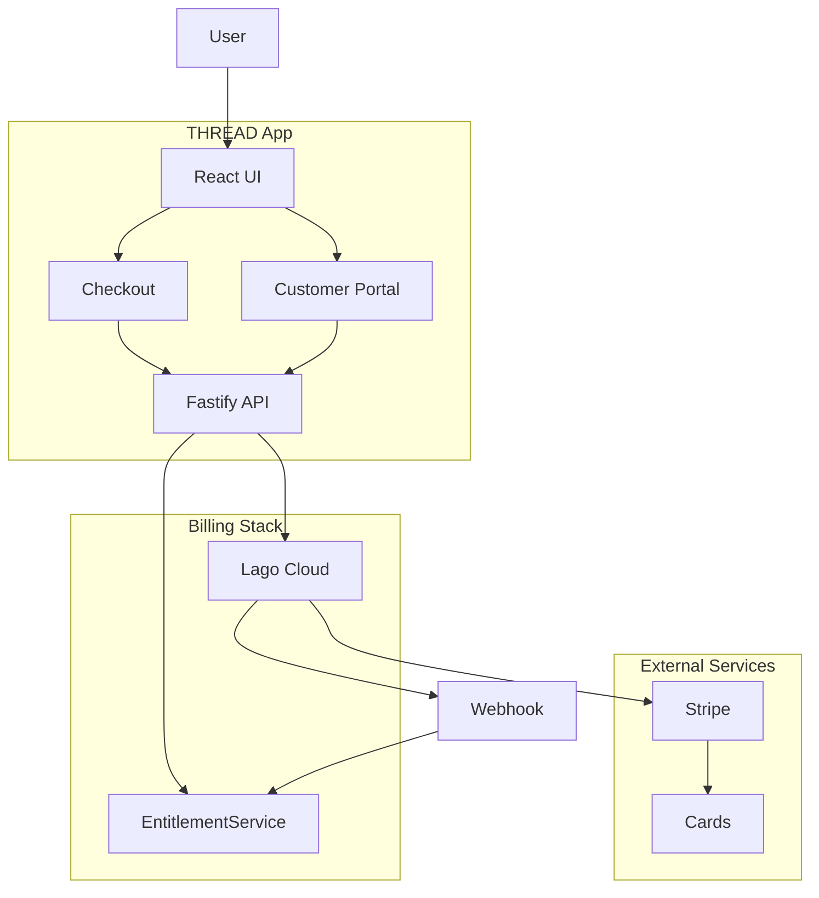
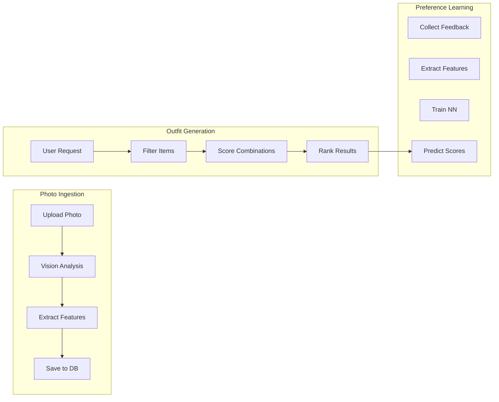
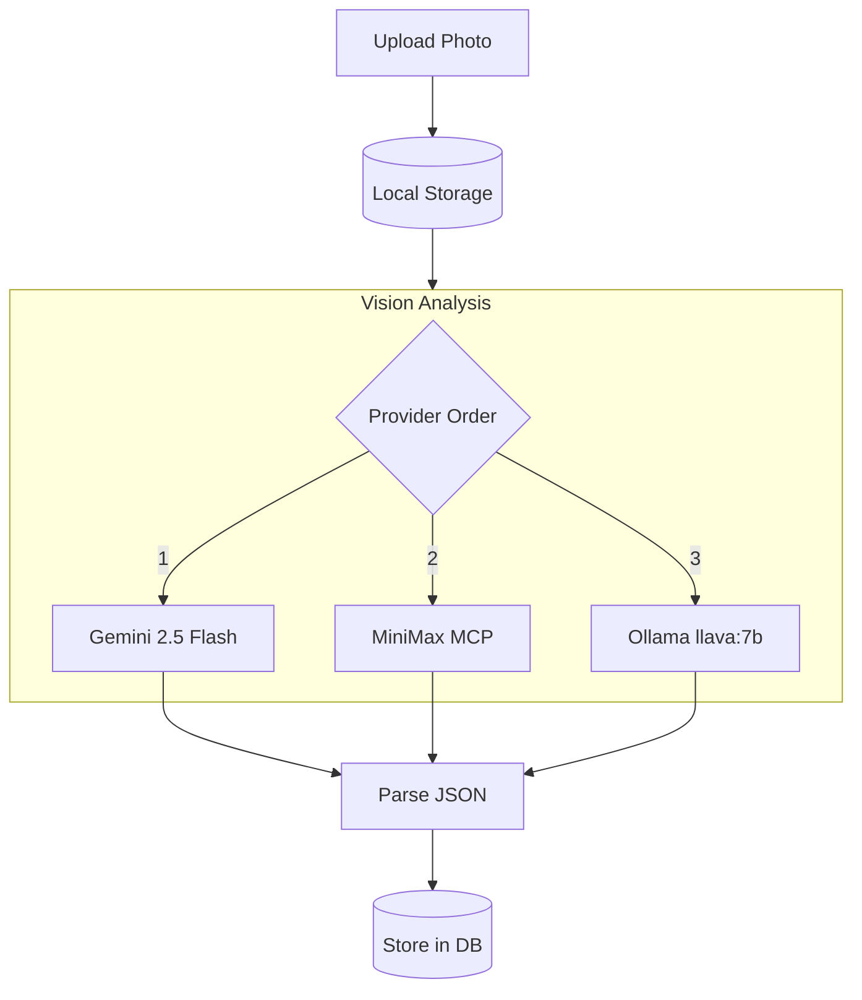
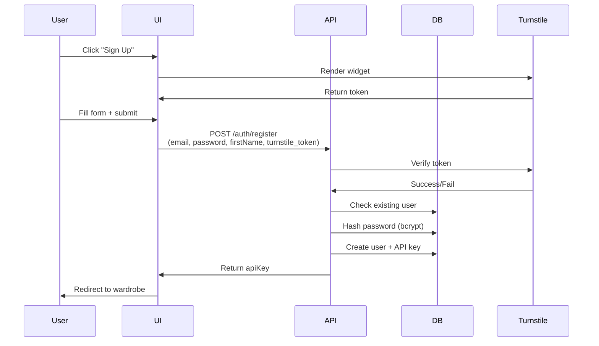

# THREAD Architecture — Complete Reference

*Last Updated: 2026-02-23*

---

## System Overview

```
┌─────────────────────────────────────────────────────────────────────────────┐
│                              THREAD APP                                      │
│                        AI Wardrobe Stylist                                   │
└─────────────────────────────────────────────────────────────────────────────┘
                                       │
        ┌───────────────────────────────┼───────────────────────────────┐
        ▼                               ▼                               ▼
┌───────────────┐              ┌───────────────┐               ┌───────────────┐
│   Browser     │              │   Mobile     │               │    API       │
│   (React)    │              │   (PWA)      │               │   Clients    │
└───────────────┘              └───────────────┘               └───────────────┘
        │                               │                               │
        └───────────────────────────────┼───────────────────────────────┘
                                        ▼
                        ┌───────────────────────────┐
                        │     Fastify Server        │
                        │     localhost:3000        │
                        └───────────────────────────┘
                                        │
        ┌───────────────────────────────┼───────────────────────────────┐
        ▼                               ▼                               ▼
┌───────────────┐              ┌───────────────┐               ┌───────────────┐
│  SQLite       │              │  Vision AI    │               │  File System │
│  (sql.js)    │              │  (Gemini)     │               │  (images/)   │
└───────────────┘              └───────────────┘               └───────────────┘
```

---

## Technology Stack

### Backend
| Component | Technology | Version |
|-----------|------------|---------|
| Runtime | Node.js | 20+ |
| Framework | Fastify | 4.x |
| Database | sql.js (SQLite) | Latest |
| ML | TensorFlow.js-node | 4.x |
| Vision | Gemini 2.5 Flash | Latest |
| Fallback Vision | Ollama (llava:7b) | Latest |
| Password | bcrypt | 5.x |
| Logging | Pino | Latest |

### Frontend
| Component | Technology | Version |
|-----------|------------|---------|
| Framework | React | 18.x |
| Build | Vite | 5.x |
| Styling | CSS Variables | — |
| PWA | vite-plugin-pwa | Latest |

### Infrastructure
| Component | Technology | Purpose |
|-----------|------------|---------|
| Process | PM2 | Always-on |
| DNS | Cloudflare | outerfit.net |
| VPS | DatabaseMart | RTX Pro 4000 Ada |
| Mesh | Tailscale | Mac ↔ VPS |
| SSL | Let's Encrypt (Caddy) | Auto-HTTPS |

---

## Providers & External Services

| Category | Provider | Purpose | Free Tier |
|----------|----------|---------|-----------|
| **Hosting** | DatabaseMart (VPS) | Production server | No |
| **Domain** | Cloudflare | DNS, CDN, SSL | Yes |
| **Code** | GitHub | Source control | Yes |
| **Email** | Resend | Transactional emails | 3k/mo |
| **Bot Protection** | Cloudflare Turnstile | Signup protection | Yes |
| **Vision AI (Primary)** | Google Gemini 2.5 Flash | Image analysis | 1.5k/day |
| **Vision AI (Fallback)** | MiniMax M2.1 | Image analysis (local) | N/A |
| **Vision AI (Fallback)** | Ollama (llava:7b) | Local image analysis | N/A |
| **LLM** | MiniMax M2.5 | Text generation | API cost |
| **LLM** | Ollama (llama3.2:3b) | Local text generation | N/A |
| **AI Code Review** | Claude Code (roborev) | Auto code review | Credits |
| **Billing** | Stripe | Payments, subscriptions | Pay per use |
| **Billing** | Lago Cloud | Subscription management | Free tier |
| **Backup** | Cloudflare R2 | Offsite backups | 10GB/mo |
| **Error Monitoring** | Sentry | Error tracking | 5k/mo |

### Vision AI Cascade
```
User uploads photo → Gemini 2.5 Flash → MiniMax → Ollama llava → Error
```

### Provider Configuration
Add credentials to `.env`:
```bash
# Resend (email)
RESEND_API_KEY=re_...

# Cloudflare (Turnstile)
TURNSTILE_SITE_KEY=0x4...
TURNSTILE_SECRET_KEY=0x4...

# Google (Gemini)
GEMINI_API_KEY=AI...

# MiniMax
MINIMAX_API_KEY=...

# R2 Backup
R2_ENDPOINT=...
R2_ACCESS_KEY=...
R2_SECRET_KEY=...
R2_BUCKET=...

# Sentry
SENTRY_DSN=https://...@sentry.io/...
VITE_SENTRY_DSN=https://...@sentry.io/...

# Lago (billing)
LAGO_API_URL=https://api.getlago.com
LAGO_API_KEY=lago_live_...
WEBHOOK_LAGO_SECRET=whsec_...

# Stripe (via Lago - rarely needed directly)
STRIPE_SECRET_KEY=sk_live_...
STRIPE_PUBLISHABLE_KEY=pk_live_...
STRIPE_WEBHOOK_SECRET=whsec_...
```

---

## Data Flow



---

## Database Schema



---

## API Endpoints

### Authentication
| Method | Path | Description |
|--------|------|-------------|
| POST | /api/v1/auth/register | Create account |
| POST | /api/v1/auth/login | Login |

### Items
| Method | Path | Description |
|--------|------|-------------|
| GET | /api/v1/items | List wardrobe |
| POST | /api/v1/items | Add item |
| GET | /api/v1/items/:id | Get item |
| PATCH | /api/v1/items/:id | Update item |
| DELETE | /api/v1/items/:id | Delete item |

### Outfits
| Method | Path | Description |
|--------|------|-------------|
| GET | /api/v1/outfits | List outfits |
| POST | /api/v1/outfits | Generate outfits |
| DELETE | /api/v1/outfits/:id | Delete outfit |

### Ingestion
| Method | Path | Description |
|--------|------|-------------|
| POST | /api/v1/ingestion/start | Start ingestion |
| GET | /api/v1/ingestion/:jobId | Check status |
| POST | /api/v1/ingestion/upload-photo | Upload photo |

### Trainer
| Method | Path | Description |
|--------|------|-------------|
| POST | /api/v1/trainer/feedback | Submit feedback |
| POST | /api/v1/trainer/train | Train model |
| GET | /api/v1/trainer/stats | Get stats |

### Profile
| Method | Path | Description |
|--------|------|-------------|
| GET | /api/v1/users | List users |
| PATCH | /api/v1/users/:id | Update user |

### Billing
| Method | Path | Description |
|--------|------|-------------|
| GET | /api/v1/billing/plans | List available plans |
| GET | /api/v1/billing/entitlement | Get current user's entitlement |
| POST | /api/v1/billing/checkout | Create checkout session |
| GET | /api/v1/billing/portal | Get customer portal URL |
| POST | /api/v1/webhooks/lago | Lago webhook receiver |

---

## Entitlements

THREAD enforces plan limits via the `requireEntitlement` middleware. All paid features check entitlements before execution.

### Plan Limits
| Plan | Items | Outfits/Day | AI Tier |
|------|-------|-------------|---------|
| free | 20 | 3 | basic |
| starter | 100 | 10 | enhanced |
| pro | 500 | Unlimited | priority |
| unlimited | Unlimited | Unlimited | priority_ml |

### Entitlement Middleware
```javascript
// Requires items entitlement
POST /api/v1/ingestion/start

// Requires outfits entitlement  
POST /api/v1/outfits/generate
POST /api/v1/outfit-trainer/generate
```

### Grace Period
When a payment fails, users retain access for 7 days (grace period) before limits are enforced.



---

## Payments Architecture

THREAD uses **Lago** for subscription management and **Stripe** as the payment processor.



### Billing Flow
1. User clicks "Upgrade" → POST /billing/checkout → returns Lago checkout URL
2. User pays on Lago/Stripe → webhook fires → entitlements updated
3. User manages subscription → GET /billing/portal → Lago customer portal

### Billing Tables
- `entitlements` — user plan, status, limits, grace period
- `billing_events` — webhook audit log

---

## Service Architecture



---

## Vision Pipeline



---

## Authentication Flow



---

## Directory Structure

```
~/Documents/outerfit/
├── package.json              # Root, runs both
├── server/
│   ├── index.js             # Fastify entry
│   ├── db/
│   │   ├── client.js        # sql.js setup
│   │   └── migrations/      # DB migrations
│   │       ├── 001_*.js
│   │       ├── 002_*.js
│   │       └── ...
│   ├── routes/              # API routes
│   │   ├── items.js
│   │   ├── outfits.js
│   │   ├── ingestion.js
│   │   ├── auth.js
│   │   ├── billing.js       # Checkout, portal, plans
│   │   ├── webhooks.js      # Lago webhooks
│   │   └── ...
│   ├── services/            # Business logic
│   │   ├── GeminiVisionService.js
│   │   ├── OllamaService.js
│   │   ├── FeatureEngine.js
│   │   ├── TrainerService.js
│   │   ├── EntitlementService.js  # Plan limits, grace period
│   │   ├── LagoService.js         # Lago API wrapper
│   │   ├── StripeService.js       # Stripe API wrapper
│   │   ├── EmailService.js       # Resend emails
│   │   └── ...
│   └── middleware/
│       ├── auth.js
│       └── entitlements.js  # requireEntitlement()
├── client/
│   ├── src/
│   │   ├── App.jsx
│   │   ├── pages/
│   │   └── components/
│   ├── index.html
│   └── vite.config.js
├── data/
│   ├── thread.db           # SQLite database
│   └── images/             # Uploaded photos
├── tests/                  # Playwright + vitest
├── docs/                   # This documentation
└── scripts/                # Deploy scripts
```

---

## Environment Variables

```bash
# Server
PORT=3000
HOST=0.0.0.0

# Database
DATABASE_PATH=./data/thread.db

# Ollama
OLLAMA_BASE_URL=http://localhost:11434
DEFAULT_VISION_MODEL=llava:7b

# Vision (Gemini Flash - free)
GEMINI_API_KEY=...
GEMINI_MODEL=gemini-2.5-flash

# Turnstile (bot protection)
TURNSTILE_SITE_KEY=...
TURNSTILE_SECRET_KEY=...

# Security
JWT_SECRET=...
API_KEY_PREFIX=thread_sk_
```

---

## Deployment

### Local Development
```bash
cd ~/Documents/outerfit
npm install
node server/index.js
# Open http://localhost:3000
```

### Production (VPS)
```bash
# 1. Provision VPS (DatabaseMart)
# 2. Run vps-setup.sh
# 3. Deploy via deploy-vps.sh
# 4. Point DNS to VPS IP
```

### Production (Render alternative)
```bash
# render.yaml blueprint included
# Requires persistent disk for SQLite
```

---

## Security

| Layer | Implementation |
|-------|---------------|
| Auth | API key (Bearer token) |
| Password | bcrypt (cost 10) |
| Bot Protection | Cloudflare Turnstile |
| Rate Limiting | @fastify/rate-limit |
| Headers | @fastify/helmet |
| HTTPS | Caddy (auto Let's Encrypt) |
| Billing Webhooks | HMAC-SHA256 signature verification |
| Entitlements | Server-side enforcement (never trust client) |

---

## Performance

| Metric | Value |
|--------|-------|
| DB Size | ~10MB typical |
| Image Storage | Local filesystem |
| Vision Latency | 4-6s per image (Gemini) |
| NN Training | <1s (2,300 params) |
| Page Load | <2s |
| Cold Start | ~30s (Render) |

---

## Testing

```bash
# All tests
npx playwright test

# Unit tests
node tests/feature-engine.test.js
node tests/gemini-vision.test.js

# API tests
npx playwright test tests/api.spec.js
```
