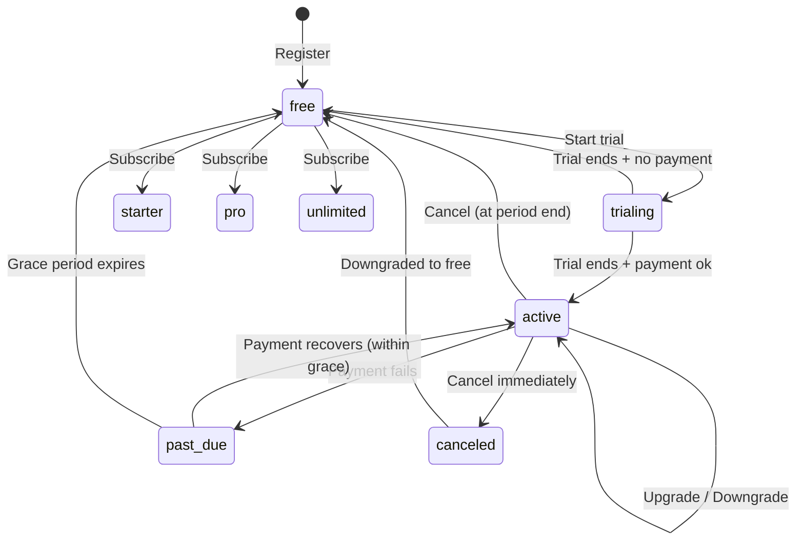
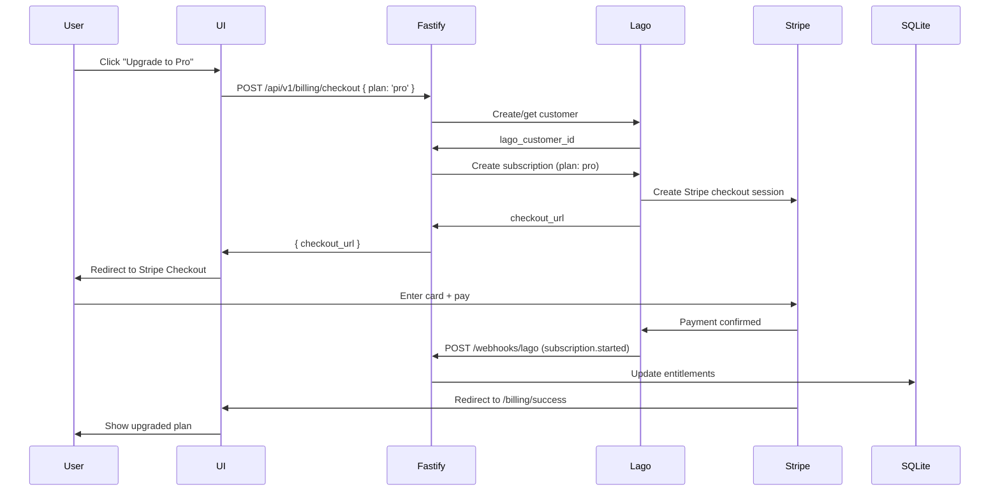

# THREAD Payments Architecture — Stripe + Lago + Entitlements

*Last Updated: 2026-02-23*

---

## Overview

THREAD uses a two-layer payment stack:

- **Lago** — subscription management, invoicing, dunning, plan lifecycle
- **Stripe** — payment gateway, card processing, Stripe Tax

Lago sits between the app and Stripe. The Fastify backend never talks to Stripe directly for billing logic — it talks to Lago, and Lago orchestrates Stripe underneath. The app reads entitlements from its own SQLite database, which is kept in sync via webhooks.

```
┌─────────────────────────────────────────────────────────────────────┐
│                          THREAD App                                  │
│              React (outerfit.net) + Fastify + SQLite                 │
└─────────────────────────────────────────────────────────────────────┘
                                  │
                    ┌─────────────┴─────────────┐
                    ▼                           ▼
          ┌──────────────────┐      ┌──────────────────────┐
          │      Lago        │      │   Fastify Webhook     │
          │  Subscription    │─────▶│   Handler             │
          │  Invoicing       │      │   /api/v1/webhooks/   │
          │  Dunning         │      │   lago                │
          └──────────────────┘      └──────────────────────┘
                    │                           │
                    ▼                           ▼
          ┌──────────────────┐      ┌──────────────────────┐
          │      Stripe      │      │   SQLite             │
          │  Payment Gateway │      │   entitlements table  │
          │  Stripe Tax      │      │                      │
          └──────────────────┘      └──────────────────────┘
```

---

## Subscription Plans

Define these plans in Lago before wiring anything else.

| Plan        | Price     | Items Limit | Outfits/Day | AI Suggestions | Notes                  |
|-------------|-----------|-------------|-------------|----------------|------------------------|
| `free`      | $0/mo     | 20          | 3           | Basic          | No card required       |
| `starter`   | $4.99/mo  | 100         | 10          | Enhanced       |                        |
| `pro`       | $9.99/mo  | 500         | Unlimited   | Priority       | Includes style history |
| `unlimited` | $19.99/mo | Unlimited   | Unlimited   | Priority + ML  | Full trainer access    |

> **Note:** Adjust limits to whatever makes sense for your pricing strategy. These are placeholders.

---

## Stack Components

### New Environment Variables

Add these to your existing `.env`:

```bash
# Lago
LAGO_API_URL=https://api.getlago.com
LAGO_API_KEY=...

# Stripe
STRIPE_SECRET_KEY=sk_live_...
STRIPE_PUBLISHABLE_KEY=pk_live_...
STRIPE_WEBHOOK_SECRET=whsec_...
STRIPE_TAX_ENABLED=true

# Entitlements
WEBHOOK_LAGO_SECRET=...        # Lago webhook signing secret
```

### New Tech Stack Additions

| Component  | Technology       | Purpose                          |
|------------|------------------|----------------------------------|
| Billing    | Lago Cloud       | Subscription + invoice mgmt      |
| Gateway    | Stripe           | Card processing                  |
| Tax        | Stripe Tax       | Automatic VAT/GST/Sales Tax      |
| UI Billing | Stripe Elements  | Secure card capture in React     |

---

## Database Schema — New Tables

Add these migrations to `server/db/migrate.js`:

```sql
-- Entitlements: source of truth for what a user can access
CREATE TABLE IF NOT EXISTS entitlements (
  id              INTEGER PRIMARY KEY AUTOINCREMENT,
  user_id         INTEGER NOT NULL UNIQUE,
  plan            TEXT NOT NULL DEFAULT 'free',
  status          TEXT NOT NULL DEFAULT 'active',
  -- status: active | past_due | canceled | paused | trialing
  lago_customer_id      TEXT,
  lago_subscription_id  TEXT,
  stripe_customer_id    TEXT,
  items_limit     INTEGER NOT NULL DEFAULT 20,
  outfits_per_day INTEGER NOT NULL DEFAULT 3,
  ai_tier         TEXT NOT NULL DEFAULT 'basic',
  -- ai_tier: basic | enhanced | priority | priority_ml
  current_period_end    DATETIME,
  grace_period_end      DATETIME,
  -- grace_period_end: access continues during dunning window
  created_at      DATETIME DEFAULT CURRENT_TIMESTAMP,
  updated_at      DATETIME DEFAULT CURRENT_TIMESTAMP,
  FOREIGN KEY (user_id) REFERENCES users(id)
);

-- Billing events log: audit trail of all webhook events
CREATE TABLE IF NOT EXISTS billing_events (
  id              INTEGER PRIMARY KEY AUTOINCREMENT,
  event_type      TEXT NOT NULL,
  lago_event_id   TEXT UNIQUE,
  user_id         INTEGER,
  payload         TEXT,   -- JSON blob
  processed_at    DATETIME DEFAULT CURRENT_TIMESTAMP
);
```

---

## Entitlements Logic

The app **never** calls Lago or Stripe at request time to check access. It reads from the local `entitlements` table only. This keeps latency low and the app resilient to third-party outages.

### EntitlementService

Create `server/services/EntitlementService.js`:

```javascript
const PLAN_LIMITS = {
  free:      { items_limit: 20,        outfits_per_day: 3,         ai_tier: 'basic' },
  starter:   { items_limit: 100,       outfits_per_day: 10,        ai_tier: 'enhanced' },
  pro:       { items_limit: 500,       outfits_per_day: Infinity,  ai_tier: 'priority' },
  unlimited: { items_limit: Infinity,  outfits_per_day: Infinity,  ai_tier: 'priority_ml' },
};

export class EntitlementService {
  constructor(db) {
    this.db = db;
  }

  // Called at registration — provision free tier immediately
  async provisionFree(userId) {
    const limits = PLAN_LIMITS.free;
    this.db.run(`
      INSERT INTO entitlements (user_id, plan, status, items_limit, outfits_per_day, ai_tier)
      VALUES (?, 'free', 'active', ?, ?, ?)
    `, [userId, limits.items_limit, limits.outfits_per_day, limits.ai_tier]);
  }

  // Called by webhook handler on subscription events
  async updateFromWebhook({ userId, plan, status, lagoCustomerId, lagoSubscriptionId,
                            stripeCustomerId, currentPeriodEnd, gracePeriodEnd }) {
    const limits = PLAN_LIMITS[plan] || PLAN_LIMITS.free;
    this.db.run(`
      UPDATE entitlements SET
        plan = ?, status = ?,
        lago_customer_id = ?, lago_subscription_id = ?,
        stripe_customer_id = ?,
        items_limit = ?, outfits_per_day = ?, ai_tier = ?,
        current_period_end = ?, grace_period_end = ?,
        updated_at = CURRENT_TIMESTAMP
      WHERE user_id = ?
    `, [plan, status, lagoCustomerId, lagoSubscriptionId, stripeCustomerId,
        limits.items_limit, limits.outfits_per_day, limits.ai_tier,
        currentPeriodEnd, gracePeriodEnd, userId]);
  }

  // Check if user has access — used in middleware
  async check(userId) {
    const row = this.db.exec(
      `SELECT * FROM entitlements WHERE user_id = ?`, [userId]
    )?.[0]?.values?.[0];
    if (!row) return null;

    const now = new Date();
    const gracePeriodEnd = row.grace_period_end ? new Date(row.grace_period_end) : null;
    const hasAccess = row.status === 'active' ||
                      row.status === 'trialing' ||
                      (row.status === 'past_due' && gracePeriodEnd && now < gracePeriodEnd);

    return { ...row, hasAccess };
  }
}
```

### Entitlement Middleware

Add to `server/middleware/entitlements.js`:

```javascript
export function requireEntitlement(feature) {
  return async (request, reply) => {
    const entitlement = await request.server.entitlementService.check(request.user.id);

    if (!entitlement?.hasAccess) {
      return reply.status(402).send({ error: 'Subscription required', code: 'PAYMENT_REQUIRED' });
    }

    // Feature-specific checks
    if (feature === 'items') {
      const itemCount = /* query item count for user */ 0;
      if (itemCount >= entitlement.items_limit) {
        return reply.status(403).send({ error: 'Item limit reached', code: 'LIMIT_REACHED', plan: entitlement.plan });
      }
    }

    if (feature === 'outfits') {
      const todayCount = /* query today's outfit count */ 0;
      if (todayCount >= entitlement.outfits_per_day) {
        return reply.status(403).send({ error: 'Daily outfit limit reached', code: 'LIMIT_REACHED' });
      }
    }

    request.entitlement = entitlement;
  };
}
```

---

## Webhook Flow

### Event Map — Lago → Entitlements

| Lago Event                        | Action                                      |
|-----------------------------------|---------------------------------------------|
| `subscription.started`            | Set plan + status = `active`               |
| `subscription.trial_ended`        | Remain active if paid, else downgrade       |
| `subscription.upgraded`           | Update plan + limits immediately            |
| `subscription.downgraded`         | Update plan + limits at period end          |
| `subscription.terminated`         | Set status = `canceled`, drop to free       |
| `invoice.payment_failure`         | Set status = `past_due`, set grace period   |
| `invoice.payment_success`         | Set status = `active`, clear grace period   |
| `customer.payment_provider_created` | Store `stripe_customer_id`               |

### Webhook Handler

Create `server/routes/webhooks.js`:

```javascript
import crypto from 'crypto';

export async function webhookRoutes(fastify) {

  // Lago webhook
  fastify.post('/api/v1/webhooks/lago', {
    config: { rawBody: true }  // need raw body for signature verification
  }, async (request, reply) => {

    // Verify Lago signature
    const signature = request.headers['x-lago-signature'];
    const expected = crypto
      .createHmac('sha256', process.env.WEBHOOK_LAGO_SECRET)
      .update(request.rawBody)
      .digest('hex');

    if (signature !== expected) {
      return reply.status(401).send({ error: 'Invalid signature' });
    }

    const { webhook_type, object } = request.body;

    // Log every event for audit trail
    fastify.db.run(`
      INSERT INTO billing_events (event_type, lago_event_id, user_id, payload)
      VALUES (?, ?, ?, ?)
    `, [webhook_type, object?.lago_id, null, JSON.stringify(request.body)]);

    try {
      await handleLagoEvent(fastify, webhook_type, object);
    } catch (err) {
      fastify.log.error({ err, webhook_type }, 'Webhook handler error');
      // Return 200 anyway — Lago will retry on 5xx, not on handler logic errors
    }

    return reply.status(200).send({ received: true });
  });
}

async function handleLagoEvent(fastify, type, object) {
  const svc = fastify.entitlementService;

  // Look up user by lago_customer_id
  const userId = await getUserIdByLagoCustomer(fastify.db, object?.customer?.lago_id);

  switch (type) {

    case 'subscription.started':
      await svc.updateFromWebhook({
        userId,
        plan: object.plan?.code,
        status: 'active',
        lagoCustomerId: object.customer?.lago_id,
        lagoSubscriptionId: object.lago_id,
        currentPeriodEnd: object.next_plan_change_date,
        gracePeriodEnd: null,
      });
      break;

    case 'invoice.payment_failure':
      // Grant 7-day grace period before cutting access
      const grace = new Date();
      grace.setDate(grace.getDate() + 7);
      await svc.updateFromWebhook({
        userId,
        plan: object.subscription?.plan?.code,
        status: 'past_due',
        gracePeriodEnd: grace.toISOString(),
      });
      break;

    case 'invoice.payment_success':
      await svc.updateFromWebhook({
        userId,
        plan: object.subscription?.plan?.code,
        status: 'active',
        gracePeriodEnd: null,
        currentPeriodEnd: object.subscription?.next_plan_change_date,
      });
      break;

    case 'subscription.terminated':
      await svc.updateFromWebhook({
        userId,
        plan: 'free',
        status: 'active',  // downgrade to free, not blocked
        gracePeriodEnd: null,
        currentPeriodEnd: null,
      });
      break;

    case 'subscription.upgraded':
    case 'subscription.downgraded':
      await svc.updateFromWebhook({
        userId,
        plan: object.plan?.code,
        status: 'active',
        currentPeriodEnd: object.next_plan_change_date,
      });
      break;

    default:
      // Unhandled event — logged above, safe to ignore
      break;
  }
}
```

---

## Subscription Lifecycle



---

## Checkout Flow



---

## New API Endpoints

Add these to the existing API surface:

| Method | Path                          | Description                        |
|--------|-------------------------------|------------------------------------|
| POST   | /api/v1/billing/checkout      | Create Lago/Stripe checkout session |
| GET    | /api/v1/billing/portal        | Get Lago customer portal URL        |
| GET    | /api/v1/billing/entitlement   | Get current user's entitlement      |
| POST   | /api/v1/webhooks/lago         | Lago webhook receiver               |

---

## Directory Structure — New Files

```
server/
├── routes/
│   ├── billing.js              # Checkout + portal endpoints
│   └── webhooks.js             # Lago webhook handler
├── services/
│   └── EntitlementService.js   # Entitlement read/write logic
├── middleware/
│   └── entitlements.js         # requireEntitlement() middleware
└── db/
    └── migrate.js              # + entitlements + billing_events tables
```

---

## Applying Entitlement Middleware

Wire `requireEntitlement` into existing routes:

```javascript
// routes/items.js
import { requireEntitlement } from '../middleware/entitlements.js';

fastify.post('/api/v1/items', {
  preHandler: [authenticate, requireEntitlement('items')]
}, handler);

// routes/outfits.js
fastify.post('/api/v1/outfits', {
  preHandler: [authenticate, requireEntitlement('outfits')]
}, handler);
```

---

## Grace Period Logic

When a payment fails, THREAD does **not** cut access immediately. Lago retries the payment (dunning) and THREAD grants a 7-day grace window.

```
Day 0  — Payment fails → status = past_due, grace_period_end = Day 7
Day 1-6 — User retains full access, sees "Payment issue" banner in UI
Day 3  — Lago retries payment (configurable in Lago dunning settings)
Day 7  — Grace expires → plan drops to free, status = active (free)
Day 7+ — User can re-subscribe at any time
```

The `hasAccess` check in `EntitlementService.check()` handles this transparently.

---

## Testing Webhooks Locally

Use the Stripe CLI and Lago's test mode together:

```bash
# Forward Lago webhooks to local Fastify
npx localtunnel --port 3000 --subdomain thread-dev
# Set tunnel URL as webhook endpoint in Lago dashboard

# Trigger test events from Lago dashboard
# Or use Lago API to simulate subscription events
```

---

## Security

| Concern                  | Implementation                                      |
|--------------------------|-----------------------------------------------------|
| Webhook authenticity     | HMAC-SHA256 signature verification on every event   |
| Card data                | Never touches THREAD — handled entirely by Stripe   |
| PCI compliance           | Stripe handles — THREAD is SAQ-A eligible           |
| Entitlement checks       | Server-side only — never trust client               |
| Billing audit trail      | All events logged to `billing_events` table         |
| Tax compliance           | Stripe Tax auto-calculates VAT/GST/Sales Tax        |
